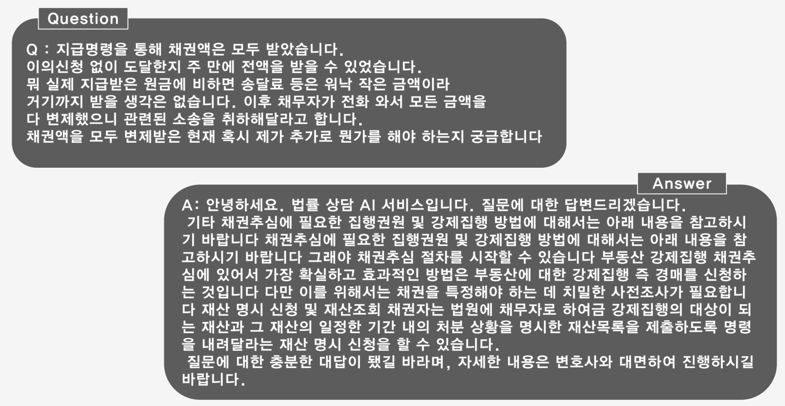
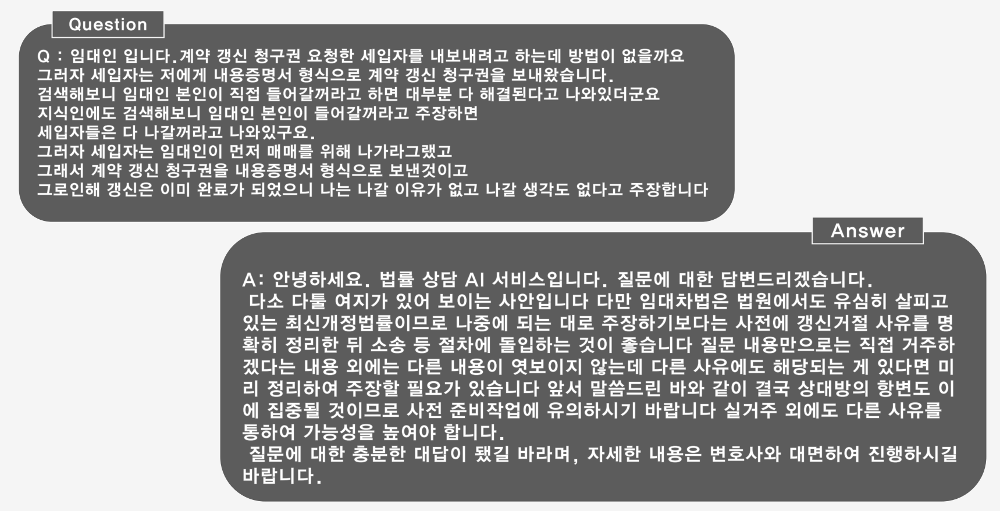

&#128526; Best-M4.t3 : **법률 상담 AI** &#128526; \
MultiCampus 2nd Semi-Project (2022.05.30~2022.06.16)
#### Description
 ```
 일상생활 중 마주치는 다양한 법적 문제, 일일이 변호사와 상담하는 것은 비용과 시간의 문제가 큼
 전문가의 답변을 바탕으로 자동으로 법률적인 조언을 해줄 수 있는 AI 개발
 ```
#### Dataset
 ```
 네이버 지식인 민사소송 및 집행 카테고리 전문가 답변 약 18,000건
 (훈련용 15,000 건, 검증용 3,000건)
```
#### Libs
 ```
 Pytorch 1.1
 networkx 2.6.3, hanspell 1.11, Mecab
```
#### Models
 ```
 Similarity Model (cos-similarity)
 Seq2Seq Model (GRU, Attention Module)
 koGPT-2 (Transformer Model)
```
#### Results


#### Contributors
```
 멀티캠퍼스 2차 Semi Project 3조입니다. 
 신재웅(github/Ukjang), 권기일(github/Kwon-Giil ), 강신웅(github/ksw0733), 박찬규(github/luckyspia)
```
